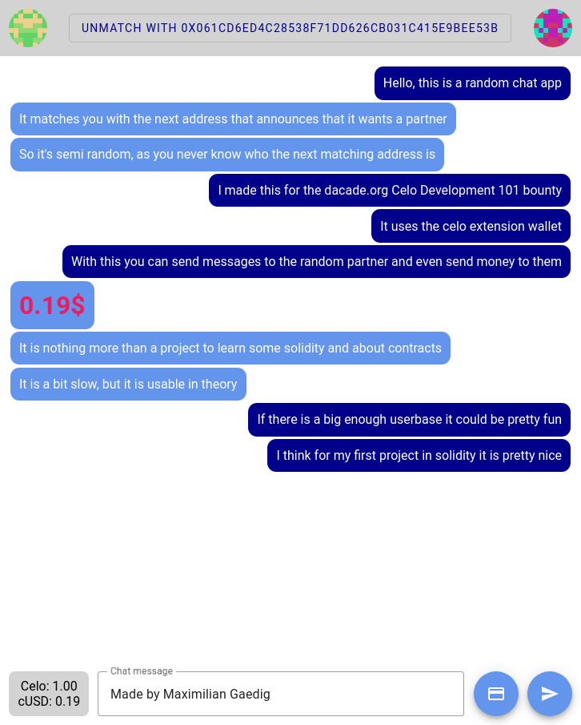

# Celo random chat app
[](https://maximiliangaedig.github.io/celo-random-chat-app/)
## Usage
1. Install the [CeloExtensionWallet](https://chrome.google.com/webstore/detail/celoextensionwallet/kkilomkmpmkbdnfelcpgckmpcaemjcdh?hl=en) from the Google Chrome store.
2. Create a wallet.
3. Go to [https://celo.org/developers/faucet](https://celo.org/developers/faucet) and get tokens for the alfajores testnet.
4. Switch to the Alfajores testnet in the CeloExtensionWallet.
5. Go to [the Application hosted on GitHub](https://maximiliangaedig.github.io/celo-random-chat-app/) or run a dev server yourself.
6. You should get a CeloExtensionWallet prompt to connect your accounts with the app, this permits the app to view your address
7. Click on "Announce that you want a partner"
8. Accept the fee
9. Wait for someone else to do the same or switch to another account and do the same
10. You can now chat with the other person and send them money
11. If you are done with them, just click on "Unmatch with {address}"
12. Repeat
## Install
```shell
npm install
```
or
```shell
yarn install
```
## Start
```shell
npm run dev
```
or
```shell
yarn dev
```
## Build
```shell
npm run build
```
or
```shell
yarn build
```
